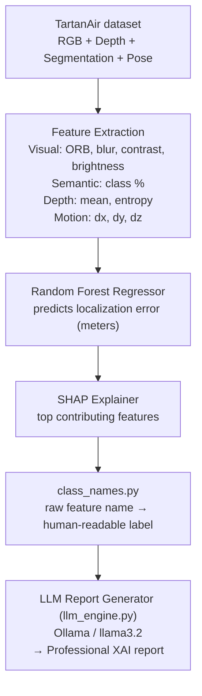

# UAV-Localization

Explainable AI (XAI) system for predicting and explaining **visual localization error** in UAVs (drones) flying in GPS-denied environments, using RGB, semantic segmentation, and depth data from the **TartanAir** simulation dataset.

The system doesn't just predict *how much* localization error to expect — it explains *why*, using SHAP-based feature attribution turned into a natural-language report by a local LLM (via Ollama).

---

## How it works



The LLM is given the raw top-N SHAP features for a prediction (name, measured value, and signed contribution, translated to a human-readable label via `class_names.py`) and interprets them directly — it reconciles each feature's *actual* direction for that specific frame instead of reciting a fixed, per-feature template. A guardrail in the system prompt still keeps it grounded: it may reason about *why* a feature had its effect, but it cannot invent a feature, value, or direction that wasn't supplied.

---

## Project structure

| File | Purpose |
|---|---|
| `config.py` | Single source of truth for dataset paths, sequence list, target/non-feature columns, and shared artifact filenames. Everything below reads from here instead of hardcoding paths |
| `dataset_loader.py` | Loads TartanAir sequences (RGB, depth, segmentation, pose) frame by frame |
| `feature_extractor.py` | Extracts visual features from RGB frames (ORB keypoints, blur, contrast, brightness, edge density) |
| `semantic_extractor.py` | Extracts per-class percentage coverage from segmentation masks |
| `class_names.py` | Maps segmentation class IDs (e.g. `class_28_percent`) to human-readable labels (e.g. "Furniture"). The single, consolidated source for this mapping — labels are best-effort placeholders until verified against TartanAir's real segmentation legend |
| `depth_features.py` | Extracts depth-based features (mean depth, depth entropy, valid depth ratio) |
| `pose_analyser.py` | Computes UAV motion features (dx, dy, dz) between consecutive poses |
| `generate_all_features.py` | Runs feature extraction across all sequences/frames, saves `all_features.csv` |
| `generate_all_labels.py` | Generates localization error labels for all sequences, saves `all_localization_labels.csv` |
| `merge_all_dataset.py` | Merges `all_features.csv` and `all_localization_labels.csv` into `training_dataset_all.csv` |
| `train_model.py` | Trains the Random Forest regressor on a held-out train/test split, saves the model, feature importance plots/metrics, and the held-out test row indices |
| `evaluation_model.py` | Re-evaluates the trained model, but only on the exact test rows `train_model.py` held out (an honest out-of-sample score, not an inflated whole-dataset score) |
| `loso_evaluation.py` | Leave-One-Sequence-Out cross-validation |
| `sequence_holdout_evaluation.py` | Trains on every sequence except one configurable sequence, tests only on that held-out sequence |
| `time_split_evaluation.py` | Temporal (within-sequence) train/test split — trains on earlier frames, tests on the last fraction of frames in each sequence |
| `graphs.py` | Generates publication-quality figures (300 DPI) from the already-trained model/dataset, without retraining anything |
| `llm_engine.py` | Builds the LLM prompt directly from SHAP feature/value/direction data and calls a local **Ollama** model (`llama3.2`) to generate the "Reasons for Localization Error" and "Recommendations" sections of the report |
| `test_system.py` | End-to-end demo: loads a real frame from the configured demo sequence, predicts error, runs SHAP, and calls `llm_engine.generate_report_direct()` to produce the full report |
| `requirements.txt` | Python package dependencies |

**Generated artifacts** (produced by the scripts above, not hand-written):
`all_features.csv`, `all_localization_labels.csv`, `training_dataset_all.csv`, `feature_importance.csv`, `evaluation_feature_importance.csv`, `evaluation_results.csv`, `loso_results.csv`, `test_predictions.csv`, `rf_localization.pkl`, `feature_names.pkl`, `test_split_indices.pkl`, and plots (`actual_vs_predicted.png`, `error_distribution.png`, `feature_importance.png`, `shap_bar.png`, `shap_summary.png`, `sample_error.png`, and the `graphs/` folder from `graphs.py`).

`.gitignore` excludes these patterns (`*.csv`, `*.pkl`, `*.png`) going forward, but a pretrained model and example artifacts (`rf_localization.pkl`, `training_dataset_all.csv`, the plots, etc.) are already committed to the repo — so `evaluation_model.py`, `graphs.py`, and `test_system.py`'s model-loading step work immediately without retraining. `test_split_indices.pkl` is the one listed artifact **not** currently committed.

---

## Requirements

- Python 3.9+
- [Ollama](https://ollama.com) installed locally, with the `llama3.2` model pulled:
  ```bash
  ollama pull llama3.2
  ```
- The [TartanAir](https://theairlab.org/tartanair-dataset/) dataset (RGB, depth, segmentation, and pose data) downloaded locally

### Python packages

```bash
pip install -r requirements.txt
```

---

## Setup

1. Clone the repo:
   ```bash
   git clone https://github.com/ankit070804/UAV-Localization.git
   cd UAV-Localization
   ```
2. Point the pipeline at your local TartanAir sequence folder. All scripts now read the dataset root from `config.py`, which defaults to a placeholder Windows path but can (and should) be overridden with an environment variable:
   ```bash
   export UAV_DATASET_ROOT=/path/to/ArchVizTinyHouseDay/Data_easy   # Linux/Mac
   set UAV_DATASET_ROOT=E:\...\ArchVizTinyHouseDay\Data_easy        # Windows
   ```
   The folder should contain the per-sequence subfolders (`P000`, `P001`, ... — see `SEQUENCES` in `config.py`).
3. Make sure Ollama is running in the background (`ollama serve`) before running `llm_engine.py` or `test_system.py`.

---

## Usage

### 1. Build the full training dataset (all sequences)
```bash
python generate_all_features.py
python generate_all_labels.py
python merge_all_dataset.py
```
Produces `training_dataset_all.csv`, the merged feature + label table used for training.

### 2. Train the model
```bash
python train_model.py
```
Trains a `RandomForestRegressor` on `training_dataset_all.csv` to predict `localization_error`, then saves:
- `rf_localization.pkl` — the trained model
- `feature_names.pkl` — the feature column order
- `test_split_indices.pkl` — the held-out test row indices (so `evaluation_model.py` scores on the same rows)
- `feature_importance.csv` / `.png`, `actual_vs_predicted.png`, `error_distribution.png`
- Prints MAE, RMSE, and R² on a 20% held-out test split.

### 3. Evaluate the model
```bash
python evaluation_model.py            # honest out-of-sample score on the held-out test rows
python loso_evaluation.py             # Leave-One-Sequence-Out cross-validation
python sequence_holdout_evaluation.py # train on all but one sequence, test on that sequence
python time_split_evaluation.py       # temporal within-sequence split
```

### 4. Generate publication figures
```bash
python graphs.py
```
Regenerates all plots (300 DPI) into `graphs/` from the already-trained model — doesn't retrain or touch any other file.

### 5. Run the end-to-end explainability demo (LLM report)
```bash
python test_system.py
```
Loads a real frame from the configured demo sequence (`DEMO_SEQUENCE` / `DEMO_FRAME` in `config.py`, overridable via `UAV_DEMO_SEQUENCE` / `UAV_DEMO_FRAME`), predicts localization error, runs SHAP to find the top contributing features, translates them to human-readable labels via `class_names.py`, and passes them straight to `llm_engine.generate_report_direct()` to produce a full report via the local `llama3.2` model, structured as:
```
Localization Summary
Reasons for Localization Error
Recommendations
Risk Level (Low / Medium / High)
```

You can also run `llm_engine.py` directly for a quick smoke test with dummy SHAP values (no dataset or trained model required):
```bash
python llm_engine.py
```

---

## Model details

- **Model:** `RandomForestRegressor` (scikit-learn)
- **Target:** `localization_error` (meters)
- **Features used:** ORB keypoint count, blur, contrast, brightness, edge density, per-class semantic percentage coverage, mean depth, depth entropy, valid depth ratio, and frame-to-frame motion (`dx`, `dy`, `dz`)
- **Explainability:** SHAP `TreeExplainer` on the trained Random Forest
- **Risk bands** used in generated reports:
  - Low: error < 0.30 m
  - Medium: 0.30–0.80 m
  - High: > 0.80 m

---

## Notes

- The LLM (`llm_engine.py`) is explicitly instructed never to mention SHAP, Random Forest, machine learning, ORB-SLAM, SIFT, or SURF by name in the generated report — it only produces a clean, professional explanation for an end user based on the supplied SHAP-derived numbers.
- `class_names.py`'s segmentation label mapping is a best-effort placeholder — TartanAir's per-scene segmentation legend for this environment hasn't been verified yet, so treat these names as approximate, not ground truth.
- Dataset paths default to a placeholder Windows path in `config.py` — override with the `UAV_DATASET_ROOT` environment variable before running anything (see Setup above).
